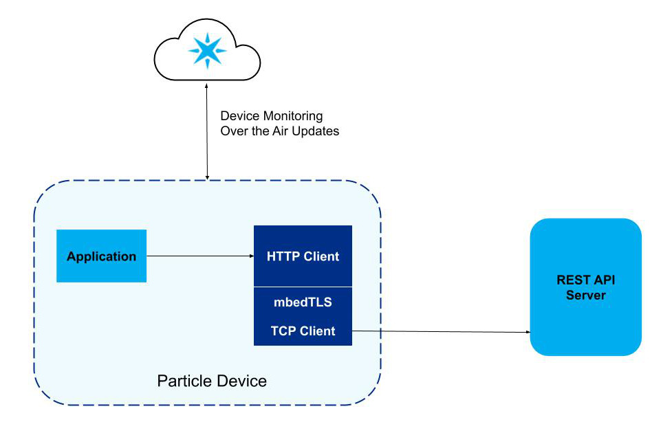

# HTTPS Client

This library implements a simplified HTTPS Client to make it easy to access a REST API
by using HTTP POST.

Currently supported:
* POST with application/json Content-Type
* POST with application/x-www-form-urlencoded Content-Type

The HTTP Client is connected to mbedTLS in order to provide TLS Encryption. The customized
mbedTLS implementation then uses the TCP Client to make the connection to the server.

## Usage

First you need to get an instance of the HTTPS client:

    HttpsClient client;

The next step is to load a certificate to validate the identity of the server. This is
required, as disabling validation makes the system vulnerable to "man in the middle" attacks.
The certificate can be embedded in the firmware, or stored in flash in the file system.
The latter allows you to use the Particle cloud to update certificates, as they have an
expiration date.

    client.initTls(CA_cert, strlen(CA_cert)+1); // Include the null terminator
    client.connect((char *)"example.com",443);

The HttpsClient object has a pointer to an HttpRequest object which allows you to
configure the request as needed. For example:

If the REST API endpoint requires Basic Authentication (using Base64-encoded 
username and password), add these with the following:

    client.req->withBasicAuthentication("username","password");

You might need to add custom headers, with this function (do not set Content-Length,
Content-Type, or User-Agent, these are set by the library):

    client.req->addHeader("Accept","*/*");

Note that both the Authentication as well as any headers are used and removed
from the object when an HTTP transaction is done. So if you are re-using the 
object for multiple back to back transactions, you will need to re-add authorization
and headers each time.

If the API uses x-www-form-urlencoded, then you can add form fields with:

    client.req->addFormField("Foo","Bar");

After the request is ready, it is time to send the HTTP POST transaction with:

    client.postUrlEncoded((char *)"/api/endpoint"); // Send x-www-form-urlencoded POST
    client.postJson((char *)"/api/endpoint","{\"foo\":\"bar\"}"); // POST JSON in the body

The HTTP Client will now conduct the transaction, and populate an HttpResponse object
that can be accessed through the `resp` pointer. This object has the following variables:

    uint16_t status_code
    Vector<HttpsClient::Header> headers
    char* body

`status_code` and `body` are self-explanatory. To access the response headers, use the
`headers` Vector. For example, you could do this:

    while (!client.resp->headers.isEmpty())
    {
        HttpsClient::Header header = client.resp->headers.takeFirst();
        Log.info("Header name: %s  Value: %s", header.name, header.value);
    }

## Examples

* **Stripe**: Uses the library to access the Stripe payment processor and make credit
card transactions. Prior to getting any device to production using this example, you 
should consult a security expert to make sure that the device meets all the requirements 
of the Payment Card Industry Data Security Standard (PCI DSS).